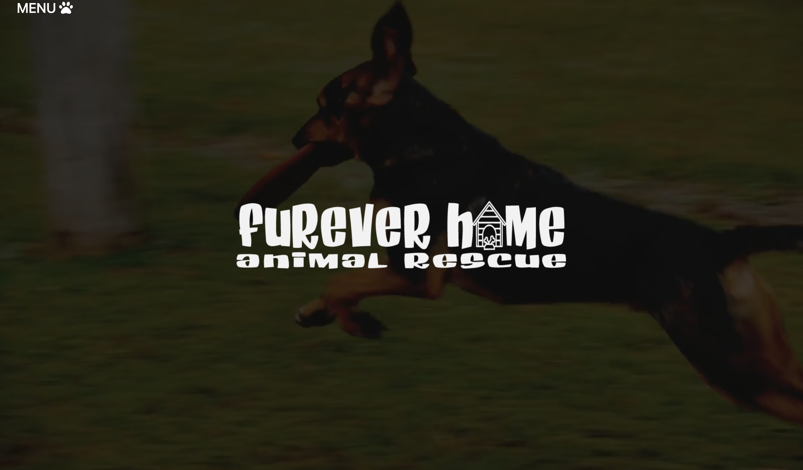

# Furever Home
  ## Description
  Furever Home was created to help families connect with dogs so that dogs can find a loving, forever home!

  You can visit the site and browse our roster of dogs ready to be adopted!

  ## Table of Contents
  * [Technologies](#technologies)
  * [Screenshot](#screenshot)
  * [Deployed](#deployed)
  * [Questions](#questions)
  
  
  ## Technologies
  * HTML5
  * CSS
  * JavaScript
  * BootStrap
  * Node.js
  * Express.js
  * Handlebars.js
  * Bcrypt
  * Dotenv
  * MYSQL
  * Sequelize
  
  ## ScreenShot  
  
  
  ## Deployed Application
  Link: https://
  
  ## Question
  If you have questions, feel free to contact us here:
  
  Mark Peterson
  
  github Link: https://github.com/mwpx777

  Agustin Martinez
  
  github Link: https://github.com/agustinxmtz

  Anthony Martinez
  
  github Link: https://github.com/Anthonyz28

  Brittany Lee
  
  github Link: https://github.com/blee2013
